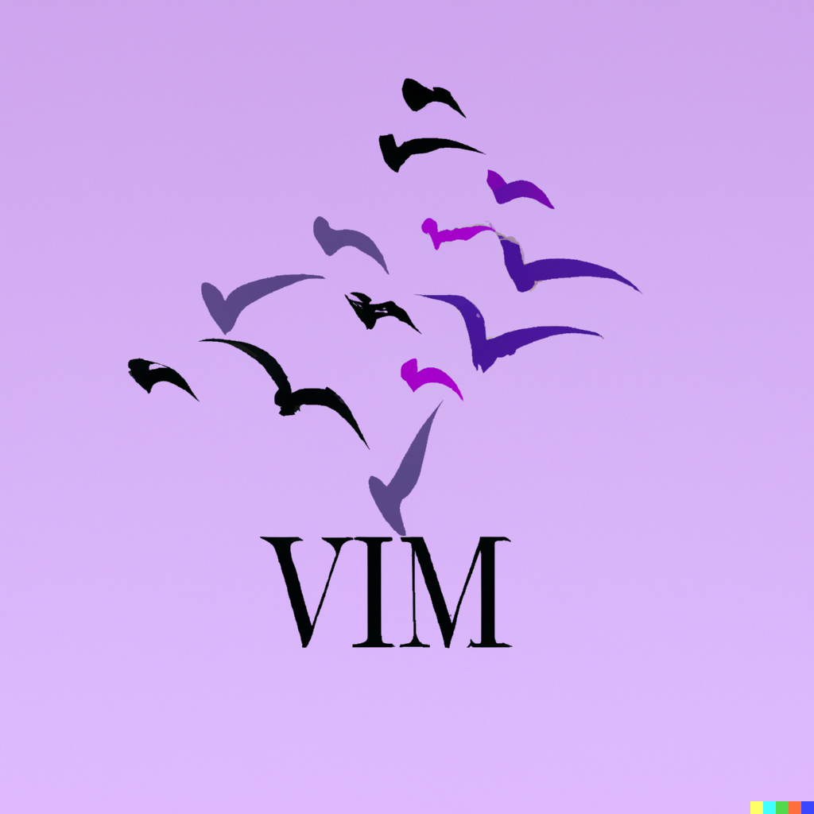

# Vim Cloudlunch

This repository contains the workshop instructions for Vim workshop as well as a default `.vimrc` config file.

<br clear="left"/>

## Getting Started

Clone this repository:

```
git clone git@github.com:adrianbartnik/Vim-Cloud-Lunch.git
```

Copy the `.vimrc` file to your home directory.

**Warning:** If you already have a `.vimrc` file, either make a backup of that file or skip this step.

```shell
cp .vimrc ~/.vimrc
```

Afterwards, open the workshop instructions by executing:

```shell
vim VimCloudLunch.md
```
